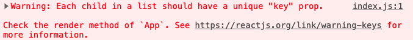

# Craigslist React

Your mission is to build a mockup for this page using react.

There is a `data.js` file to make seeding into a slightly less tedious copy-paste job. Note that stretch goal #1 leads you towards a much easier & better way, which you are strongly urged to try!

## Notes
1. Don't worry about the searchbar at the top, just the 6 cards.
1. For the links, you can make `<a>` tags with `href` equal to the `linkTo` value.
1. One card has no `beds` property in the mockup. For core goals, use the number of beds directly from data.js. Handling cards with no beds is addressed in stretch goals.
1. One card data has a `sqft` property. This is addressed in a stretch goal, but for cores you don't have to worry about it.
1. Don't worry about the little trashcan icons.
1. Remember flexbox and grid? All the old rules still apply: size up the task and figure out for yourself which tool makes sense for this job.

## Core goals
1. Create a fresh react app in this folder
1. `cd` into your new app, and wipe out `App.js` and `App.css`
1. `mkdir` a components folder to contain your components
1. Make a `Card` component that will receive props from its parent, and display its various props in its `return`ed jsx
1. Invoke the `Card` component multiple times in your `App.js`, giving it different props each time.

## Stretch goals
1. Conditional rendering: If a data object has a beds property of 0, don't display any bedroom data at all. See the center card in the top row of the mockup for an example.
1. More conditional rendering: If a data object has a sqft property, display it as it looks in the first card of the second row in the mockup.
1. Let's avoid the 6 separate invocations of Card: In your `App.js`, create a variable that contains the whole array of objects from `data.js`. (You could copy-paste it, or import it.) Iterate through this array, mapping it into a chunk of jsx for each object. This tutorial is helpful: https://scotch.io/courses/10-react-challenges-beginner/loop-over-and-display-data-with-jsx. Note that in this tutorial, they just write some h3 and p tags in the map loop, but we are instead using a Card component! Two more tutorials that are both a little farther from what we covered today: https://thinkster.io/tutorials/iterating-and-rendering-loops-in-react, https://medium.com/how-to-react/different-ways-to-loop-through-arrays-and-objects-in-react-39bcd870ccf
1. You might have noticed a warning like this in your console:

Though it seems like our app continues to work, this actually can introduce VERY confusing bugs down the line and should be dealt with. Google this message and see what it means, and what to do about it.
1. Break each card down into subcomponents. (The card component should forward the relevant pieces of its props into its children components)

